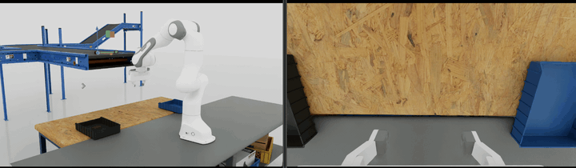

# Factory Task IsaacLab Overlay

This repo is intended for IsaacLab factory-task development and GR00T N-series policy evaluation. It provides task
overlays, LeRobot conversion utilities, and both open-loop and closed-loop evaluation workflows for GR00T N.x models.

Current validated GR00T version: **GR00T N1.7**.

This repository is an IsaacLab 3 Beta overlay focused on factory robot learning scenarios.

Install IsaacLab 3 Beta first:
[IsaacLab v3.0.0-beta](https://github.com/isaac-sim/IsaacLab/tree/v3.0.0-beta)

Then copy this overlay into the IsaacLab root while preserving the same relative file hierarchy:

```bash
OVERLAY=/path/to/factory-task-isaaclab
ISAACLAB=/path/to/IsaacLab

rsync -av "$OVERLAY"/ "$ISAACLAB"/
```

Set the Franka sorting USD asset root before running the task:

```bash
export FRANKA_SORTING_ASSET_DIR=/path/to/franka_sorting_assets
```

The asset directory should contain the factory Franka, belt, box, and bin USD files referenced by the Franka task config.



## Focus

This repo targets factory-style manipulation workflows:

- pick-and-place
- bin sorting
- object transfer
- gripper-based manipulation
- closed-loop policy evaluation
- dexterous-hand factory tasks to be added later

The first implemented task family is Franka box sorting with GR00T N1.7/LeRobot data conversion and closed-loop
evaluation.

GR00T baseline:
[NVIDIA Isaac-GR00T N1.7 release](https://github.com/NVIDIA/Isaac-GR00T/tree/n1.7-release)

Current Franka sorting closed-loop benchmark:

| Policy action space | GR00T N1.7 modality config | GR00T N1.7 action representation | Training setup | Closed-loop SR | Notes |
| --- | --- | --- | --- | --- | --- |
| EEF / IK-relative | [EEF config](scripts/benchmarks/gr00t/franka/franka_modality_config.py) | `franka_eef_delta_pos`, `franka_eef_delta_rot`, `franka_gripper_cmd` as raw continuous actions | Same 105-demo dataset source, 10k steps, global batch size 256 | 65% | Uses IsaacLab IK-relative execution. The HDF5 action is already a relative EEF delta, so the GR00T config marks it as `ABSOLUTE + NON_EEF + DEFAULT` to avoid applying another relative EEF transform. |
| Joint space | [Joint config](scripts/benchmarks/gr00t/franka/franka_joint_modality_config.py) | `franka_joint_pos`, `franka_gripper_width` | Same 105-demo dataset source, 20k steps, global batch size 256 | 30% | Uses relative joint action processing for arm joints and absolute gripper width. More sensitive to pose variation, contact, and closed-loop drift. |

Modality config files:
[EEF config](scripts/benchmarks/gr00t/franka/franka_modality_config.py),
[Joint config](scripts/benchmarks/gr00t/franka/franka_joint_modality_config.py).

For the EEF policy, `ABSOLUTE` in the GR00T modality config does not mean the robot executes absolute EEF poses. It means GR00T should learn the recorded IK-relative delta vector directly as a normal continuous action, while IsaacLab's IK-relative controller applies that delta during rollout.

## Future Plan

- Add another 100 Franka sorting episodes with broader box pose and task-progress coverage.
- Add DAgger evaluation to reduce closed-loop drift and collect correction data.

## Main Links

Franka benchmark details:

[Franka GR00T benchmark README](scripts/benchmarks/gr00t/franka/README.md)

Franka command reference:

[Franka GR00T command reference](scripts/benchmarks/gr00t/franka/franka_manipulation_gr00t_commands.md)

Full Franka pipeline notes:

[Franka manipulation pick-and-place guide](docs/source/how-to/franka_manipulation_pick_place_notes.md)

## Included Overlay Paths

```text
docs/source/how-to/franka_manipulation_pick_place_notes.md
docs/source/_static/how-to/franka_sorting_closed_loop.gif
scripts/benchmarks/gr00t/franka/
source/isaaclab_tasks/isaaclab_tasks/manager_based/manipulation/pick_and_place/config/franka/
source/isaaclab_tasks/isaaclab_tasks/manager_based/manipulation/pick_and_place/mdp/
```
