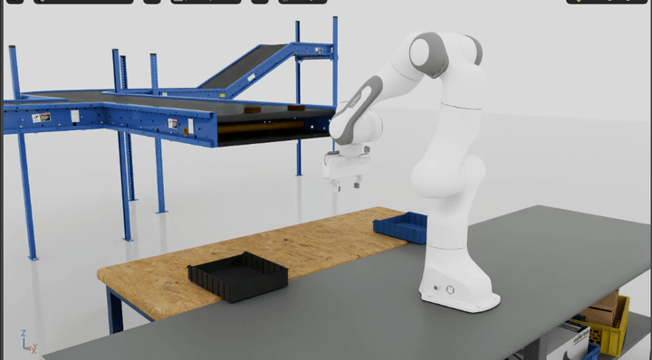
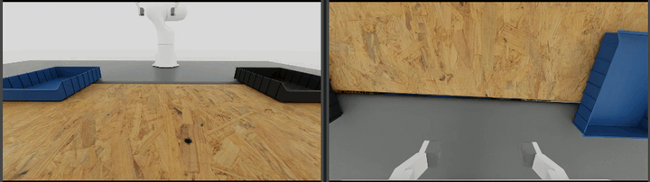

# Factory Task IsaacLab Overlay

This IsaacLab 3 Beta overlay provides factory manipulation tasks and reusable GR00T N-series workflows for data
recording, LeRobot conversion, supervised fine-tuning, human-gated DAgger, and closed-loop evaluation.

Current validated stack: **IsaacLab 3 Beta + GR00T N1.7**.

Install IsaacLab 3 Beta first:
[IsaacLab v3.0.0-beta](https://github.com/isaac-sim/IsaacLab/tree/v3.0.0-beta)

Then sync this overlay into the IsaacLab root while preserving the same relative file hierarchy, including the README
and docs media:

```bash
OVERLAY=/path/to/factory-task-isaaclab
ISAACLAB=/path/to/IsaacLab

rsync -av \
  "$OVERLAY/README.md" \
  "$OVERLAY/docs" \
  "$OVERLAY/scripts" \
  "$OVERLAY/source" \
  "$ISAACLAB"/
```

Set the Franka sorting USD asset root before running the task:

```bash
export FRANKA_SORTING_ASSET_DIR=/path/to/franka_sorting_assets
```

The asset directory should contain the factory Franka, belt, box, and bin USD files referenced by the Franka task config.

Viewport:



Training camera views:



## Scope

The reference task is Franka two-object box sorting with wrist and table cameras. The repository supports EEF/IK-relative
and joint-space policies, aligned demonstration replay, open/closed-loop evaluation, and a complete human-gated DAgger
workflow. Additional factory tasks can reuse the same task and data contracts.

GR00T baseline: [NVIDIA Isaac-GR00T N1.7 release](https://github.com/NVIDIA/Isaac-GR00T/tree/n1.7-release).

## Franka GR00T Action Horizon

The Franka GR00T modality configs use a runtime action horizon:

```bash
export ACTION_HORIZON=32
export FRANKA_GROOT_ACTION_HORIZON=$ACTION_HORIZON
```

The default is 32 when `FRANKA_GROOT_ACTION_HORIZON` is not set. Use the same value for dataset statistics,
training, open-loop evaluation, and closed-loop client feedback actions. The current task-space and joint-space configs
use the current camera frame only, with `video.delta_indices = [0]`.

## EEF and joint-space policies

Both policy spaces remain supported. Choose one representation and keep its semantics consistent across base data,
DAgger data, normalization, training, and inference.

| Policy space | Model action | IsaacLab execution | Main engineering consideration |
| --- | --- | --- | --- |
| [EEF / IK-relative](scripts/benchmarks/gr00t/franka/franka_modality_config.py) | EEF position delta, rotation delta, gripper command | Differential IK applies the relative command | Compact task-space behavior, but depends on IK configuration and singularity handling |
| [Joint space](scripts/benchmarks/gr00t/franka/franka_joint_modality_config.py) | Seven joint targets plus gripper width/target | Joint-position controller consumes decoded targets directly | Avoids online IK, but joint redundancy and wrist-pose consistency become data-quality concerns |

In the EEF modality config, GR00T `ABSOLUTE` means the recorded IK-relative delta vector is learned as the action value;
it does not mean the robot executes an absolute world-frame EEF pose.

Numerical EEF results from older protocols are intentionally omitted. They should be restored only after EEF and
joint-space checkpoints are evaluated with the same frozen scenes, repeats, success metric, and failure review.

## Current closed-loop reference

The current reportable comparison uses 50 frozen scenes × 3 policy-noise repeats, common inference noise between the
base and DAgger checkpoints, and manual review of every automatic failure. Values below are adjudicated success rates.

| Joint-space gripper representation | Inference close threshold | Base (20k) | Base + DAgger SFT (+5k) | Net DAgger change |
| --- | ---: | ---: | ---: | ---: |
| Continuous achieved width | `0.065 m` | 120/150 = 80.00% | 132/150 = 88.00% | **+8.00 pp** |
| Direct binary target (`close=0`, `open=0.08`) | `0.04 m` | 123/150 = 82.00% | 120/150 = 80.00% | −2.00 pp |

The result is representation-dependent: DAgger materially improved the Continuous policy, while changing to a binary
target did not improve this task. Binary targets remain supported, but they are not a universal replacement for a
working continuous representation. For a first DAgger iteration, preserve the evaluated base representation and
normalizer, then measure recovery-data value as the primary variable.

Detailed protocol, paired improved/regressed counts, and interpretation live in the
[VLA DAgger system reference](docs/vla_dagger_reference.md).

## Main Links

- [Franka GR00T command guide](scripts/benchmarks/gr00t/franka/franka_manipulation_gr00t_commands.md)
- [VLA DAgger customer guide](docs/vla_dagger_guide.md)
- [VLA DAgger system reference](docs/vla_dagger_reference.md)
- [Codex VLA DAgger Skill](.agents/skills/vla-dagger/SKILL.md)
- [Action-horizon 16-to-32 migration note](scripts/benchmarks/gr00t/franka/action_horizon_16_to_32.md)
