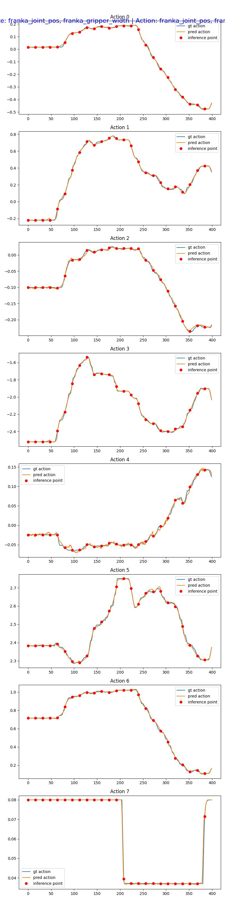

# Franka Factory Sorting GR00T Benchmark

This folder contains the Franka factory sorting benchmark tools for the IsaacLab 3 Beta overlay. It covers demo replay,
LeRobot v2 conversion, GR00T training data preparation, open-loop evaluation, and closed-loop GR00T server/client tests.

The Franka policy pipeline is based on
[NVIDIA Isaac-GR00T N1.7 release](https://github.com/NVIDIA/Isaac-GR00T/tree/n1.7-release).

The current runnable commands are also collected in `franka_manipulation_gr00t_commands.md`.

## Path Variables

The commands use customer-provided paths:

```bash
export ISAACLAB=/path/to/IsaacLab
export GROOT=/path/to/Isaac-GR00T
export LOCAL_GROOT_WORKDIR=/path/to/local/gr00t_workdir
export FRANKA_SORTING_ASSET_DIR=/path/to/franka_sorting_assets
```

`FRANKA_SORTING_ASSET_DIR` should point to the USD asset root for the factory Franka, belt, boxes, and bins.

## Benchmark Scope

Main teleoperation task:

```text
Isaac-Pick-Place-Franka-IK-Rel-v0
```

Replay camera task:

```text
Isaac-Pick-Place-Franka-IK-Rel-Replay-Camera-v0
```

Joint-position replay camera task:

```text
Isaac-Pick-Place-Franka-Joint-Position-Replay-Camera-v0
```

Sorting target mapping:

```text
box_3_label -> blue bin
box_4_no    -> black bin
```

Current EEF/task-space closed-loop benchmark result:

```text
Franka sorting EEF policy: 65% SR
Model: GR00T N1.7
Training: 20k steps, global batch size 256
```

This result uses the task-space/EEF GR00T N1.7 checkpoint trained for 20k steps with global batch size 256. For new
reportable numbers, rerun the closed-loop client with a fixed checkpoint, fixed seed/task setup, and
`--num-total-experiments` set to the desired trial count.

## Data Representation

Use task-space conversion for this dataset. The recorded action is a relative IK command:

```text
[dx, dy, dz, d_rx, d_ry, d_rz, gripper_cmd]
```

Generate replay videos for the HDF5 dataset:

```bash
cd "$ISAACLAB"
conda activate isaaclab3_beta

./isaaclab.sh -p scripts/benchmarks/gr00t/franka/replay_demos_with_camera.py \
  --task Isaac-Pick-Place-Franka-IK-Rel-Replay-Camera-v0 \
  --dataset_file datasets/dataset_sorting_105.hdf5 \
  --video \
  --camera_view_list wrist_camera table_camera \
  --video-output-dir datasets/dataset_sorting_105/generated_videos \
  --validate_success_rate \
  --viz none
```

The generated videos are named for the converter:

```text
datasets/dataset_sorting_105/generated_videos/demo_0_wrist_camera.mp4
datasets/dataset_sorting_105/generated_videos/demo_0_table_camera.mp4
```

Convert the low-dimensional HDF5 dataset without videos:

```bash
python scripts/benchmarks/gr00t/franka/convert_hdf5_to_lerobot_task_space.py \
  --hdf5-file-path datasets/dataset_sorting_105.hdf5
```

Default output:

```text
datasets/dataset_sorting_105/lerobot_task_space
```

Convert the HDF5 dataset with replay videos:

```bash
python scripts/benchmarks/gr00t/franka/convert_hdf5_to_lerobot_task_space.py \
  --hdf5-file-path datasets/dataset_sorting_105.hdf5 \
  --video-dir datasets/dataset_sorting_105/generated_videos \
  --require-videos \
  --overwrite
```

Convert the same HDF5 dataset to joint-space LeRobot data:

```bash
python scripts/benchmarks/gr00t/franka/convert_hdf5_to_lerobot_joint_space.py \
  --hdf5-file-path datasets/dataset_sorting_105.hdf5 \
  --video-dir datasets/dataset_sorting_105/generated_videos \
  --require-videos \
  --overwrite
```

Default joint-space output:

```text
datasets/dataset_sorting_105/lerobot_joint_space
```

The joint-space converter stores:

```text
state[t]  = [panda_joint1..panda_joint7, gripper_width] at t
action[t] = [panda_joint1..panda_joint7, gripper_width] at t + 1
```

## Joint-Space Open-Loop Sanity Check

The 20k-step joint-space GR00T N1.7 checkpoint tracks the held-out demonstration trajectory closely in open-loop
evaluation:



For GR00T training, merge `data_config.py` into Isaac-GR00T's `gr00t/experiment/data_config.py` and add:

```python
"franka_pick_place_relative_task_space": FrankaPickPlaceRelativeTaskSpaceDataConfig(),
```

## Closed-Loop EEF Evaluation

Start the GR00T server with an EEF/task-space checkpoint:

```bash
cd "$GROOT"

CKPT="$CHECKPOINT_ROOT/franka_gr00t_bs256_20000/checkpoint-10000"

UV_LINK_MODE=copy NO_ALBUMENTATIONS_UPDATE=1 CUDA_VISIBLE_DEVICES=0 \
uv run python gr00t/eval/run_gr00t_server.py \
  --model-path "$CKPT" \
  --embodiment-tag NEW_EMBODIMENT \
  --device cuda:0 \
  --host 0.0.0.0 \
  --port 5555
```

Run the IsaacLab client in another terminal:

```bash
cd "$ISAACLAB"
deactivate 2>/dev/null || true
unset VIRTUAL_ENV
conda activate isaaclab3_beta

./isaaclab.sh -p scripts/benchmarks/gr00t/franka/gr00t_inference_client_franka.py \
  --policy-type task_space \
  --task Isaac-Pick-Place-Franka-IK-Rel-Replay-Camera-v0 \
  --server-host localhost \
  --server-port 5555 \
  --language-instruction "Pick up the labeled box and place it into the blue bin. Pick up the unlabeled box and place it into the black bin." \
  --num-total-experiments 10 \
  --max-inference-steps 62 \
  --num-feedback-actions 16
```

Add `--headless` to the client command for no GUI.

## Related Documentation

Full pipeline notes:

```text
docs/source/how-to/franka_manipulation_pick_place_notes.md
```

Command reference:

```text
scripts/benchmarks/gr00t/franka/franka_manipulation_gr00t_commands.md
```
